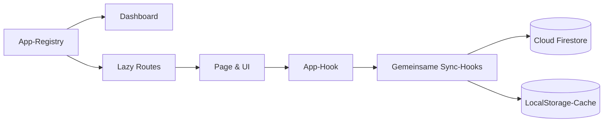

<div align="center">
  
  <h1>BengtsToolBox</h1>
  <p><strong>Ein modularer, synchronisierter App-Hub für Spieleabende, Gruppen und kleine Turniere.</strong></p>
  <p>
    
    
    
    
    
  </p>
</div>

> [!NOTE]
> Diese `README.md` ist die GitHub-Landingpage des Repositories. GitHub rendert darin Markdown, Mermaid und einen sicheren Teil von HTML. Eine separate `README.html` würde lediglich als Datei angezeigt und ist deshalb nicht nötig.

## Was steckt drin?

| App | Zweck | Datenhaltung |
| --- | --- | --- |
| Scoreboard | Gemeinsame Spielstände, Spieler und Ereignisse | Firestore + lokaler Cache |
| Live-Buzzer | Team-Buzzer und Rundensteuerung | Firestore + lokaler Cache |
| Fortschritts-Dashboard | Spieler, Events, Diagramm und Archiv | Firestore + lokaler Cache |
| Random Number Generator | Würfel und Zufallszahlen | Firestore + lokaler Cache |
| Glücksrad | Gewichtete Einträge und Ziehungsverlauf | Firestore + lokaler Cache |
| Sushi Map | Besuchte Länder und Bundesländer | Firestore + lokaler Cache |
| SK Anderten Turnier-App | Swiss-, Rundenturnier- und Hand-and-Brain-Verwaltung | Firestore + lokaler Cache |

Zusätzlich existiert mit **Schlag den Raab** ein geschützter Bereich außerhalb der Dashboard-Registry. Er bündelt eigenständige Spielmodule wie den Münzwurf.

## Architektur auf einen Blick



- **Registry-getrieben:** `src/apps/registry.ts` versorgt Dashboard, Standardrouten und Lazy Loading.
- **Feature-lokal:** Page, Hook, Typen und fachliche Hilfen einer App bleiben in ihrem App-Ordner.
- **Gemeinsam statt doppelt:** UI-Primitiven liegen in `src/components/ui`, appübergreifende Bausteine in `src/apps/shared`.
- **Offline-tolerant:** Ohne Firebase-Konfiguration arbeiten die Sync-Hooks lokal; mit Konfiguration synchronisieren sie anonym authentifiziert in Echtzeit.
- **SPA-fähig:** Firebase Hosting leitet unbekannte Pfade auf `index.html` um, damit direkte App-URLs funktionieren.

Die verbindlichen Details stehen in der [Architekturdokumentation](docs/ARCHITECTURE.md).

## Lokal entwickeln

Voraussetzung ist **Node.js 22 oder neuer**.

```powershell
npm ci
Copy-Item .env.example .env.local
npm run dev -- --host 127.0.0.1 --port 5180 --strictPort
```

Ohne ausgefüllte `.env.local` startet die Toolbox bewusst im lokalen Modus. Mit Firebase-Werten ist die App normalerweise unter `http://127.0.0.1:5180` mit Realtime-Sync verfügbar.

### Qualitätschecks

```powershell
npm run lint
npm run build
npm run preview
```

`npm run build` führt zuerst die TypeScript-Prüfung und anschließend den produktiven Vite-Build aus. Für Änderungen an Sync oder Firebase sollte danach zusätzlich eine synchronisierte App in zwei Browserfenstern geprüft werden.

## Eine App ergänzen

1. Feature unter `src/apps/<app-id>/` anlegen und seine öffentliche Page über `index.ts` exportieren.
2. UI, Zustand und Fachlogik entlang der bestehenden App-Muster trennen.
3. Persistente Pfade ausschließlich in `src/lib/firebase/paths.ts` ergänzen.
4. Eine reguläre Dashboard-App in `src/apps/registry.ts` registrieren; Sonderbereiche bewusst direkt im Router eintragen.
5. `npm run lint` und `npm run build` ausführen.

Der [App Development Guide](docs/APP_DEVELOPMENT_GUIDE.md) enthält die vollständige Checkliste.

## Deployment

| Ereignis | Workflow | Ergebnis |
| --- | --- | --- |
| Push auf `main` oder manueller Start | `firebase-hosting.yml` | Produktions-Deployment auf Firebase Hosting |
| Pull Request aus demselben Repository | `firebase-hosting-pull-request.yml` | temporärer Firebase Preview Channel |

Hosting veröffentlicht `dist`. Firestore-Regeln und Indizes werden getrennt ausgerollt:

```powershell
npx firebase-tools deploy --only firestore:rules,firestore:indexes
```

Secrets, Variablen, Erstinstallation und Fehlerdiagnose beschreibt der [Online Hosting Guide](docs/ONLINE_HOSTING_GUIDE.md).

## Projektlandkarte

```text
src/
├── app/                    # Router, Lazy Routes, globale Provider
├── apps/
│   ├── registry.ts         # Metadaten und Loader regulärer Apps
│   ├── shared/             # Appübergreifende Modelle und Komponenten
│   └── <app-id>/           # Eigenständiges Feature
├── components/
│   ├── layout/             # Shell und Dashboard
│   └── ui/                 # Wiederverwendbare UI-Primitiven
├── lib/firebase/           # Client, Pfade, Sync-Hooks, lokaler Cache
└── styles/                 # Globale Styles und Design-Tokens
```

## Dokumentation

- [Architektur](docs/ARCHITECTURE.md) – Grenzen, Datenfluss und technische Entscheidungen
- [App Development Guide](docs/APP_DEVELOPMENT_GUIDE.md) – belastbarer Ablauf für neue Features
- [Online Hosting Guide](docs/ONLINE_HOSTING_GUIDE.md) – Firebase- und GitHub-Actions-Betrieb

## Lizenz

[MIT](LICENSE) © 2026 Bengt Rademacher
