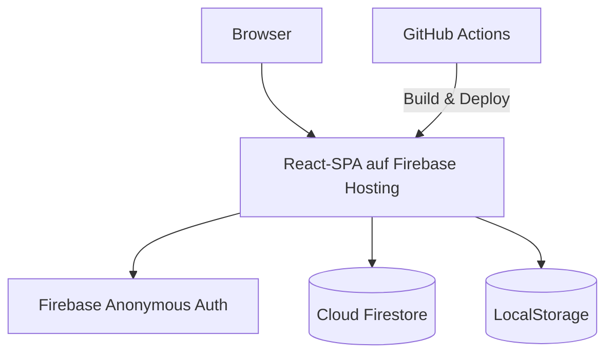
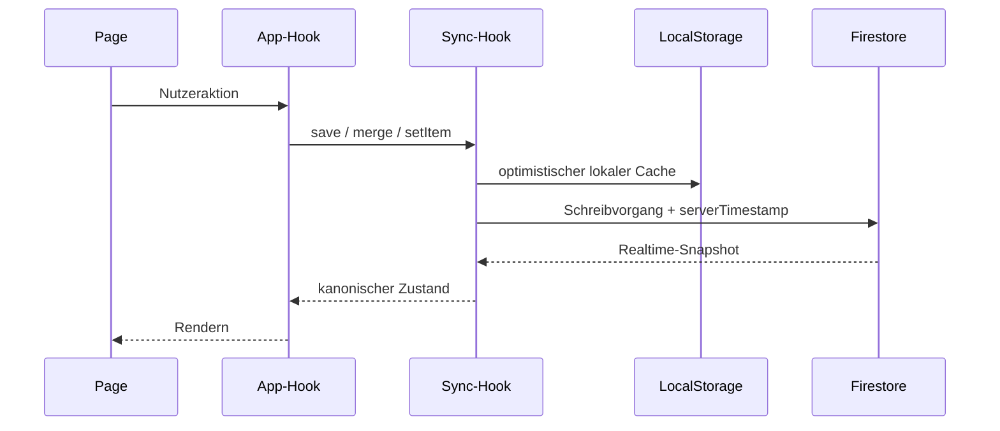

# Architektur

Diese Datei beschreibt die stabilen Grenzen von BengtsToolBox. Der aktuelle Code ist für Implementierungsdetails maßgeblich; diese Dokumentation hält bewusst keine Funktionslisten oder Fachregeln einzelner Apps doppelt vor.

## Systemkontext

BengtsToolBox ist eine clientseitige React-SPA. Vite baut statische Dateien, Firebase Hosting liefert sie aus, und Cloud Firestore synchronisiert gemeinsam genutzte Zustände. Es gibt keinen eigenen Application Server.



## Schichten und Verantwortungen

| Bereich | Verantwortung | Darf nicht übernehmen |
| --- | --- | --- |
| `src/app` | Router, Lazy-Route-Auflösung, globale Provider | App-Fachlogik |
| `src/components/layout` | Shell und Dashboard | Persistenzlogik |
| `src/apps/registry.ts` | Metadaten und Loader regulärer Dashboard-Apps | Feature-Zustand |
| `src/apps/<app-id>` | UI, Zustand, Typen und Fachlogik eines Features | eigene Firebase-Initialisierung |
| `src/apps/shared` | wirklich appübergreifende Modelle und Komponenten | app-spezifische Sonderfälle |
| `src/components/ui` | generische UI-Primitiven | Geschäftslogik |
| `src/lib/firebase` | Firebase-Client, kanonische Pfade, Sync und lokaler Cache | UI oder App-Regeln |

Abhängigkeiten zeigen grundsätzlich nach innen: Eine Page nutzt ihren Feature-Hook und gemeinsame UI; ein Hook nutzt zentrale Firebase-Helfer. Gemeinsame Infrastruktur importiert keine App.

## Routing und App-Registry

Reguläre Apps werden genau einmal in `src/apps/registry.ts` beschrieben. Die Registry liefert Titel, Beschreibung, Pfade, Status, Icon und Lazy Loader an Dashboard und Router. Das verhindert doppelte Navigations- und Routinglisten.

Sonderbereiche dürfen außerhalb der Registry existieren, wenn sie bewusst nicht als Dashboard-App erscheinen. Aktuell gilt dies für `/schlag-den-rabe` und dessen Unterseiten; diese Routen stehen explizit in `src/app/router.tsx` und ihre Loader in `src/app/lazyRoutes.tsx`.

## Feature-Aufbau

Ein Feature besitzt nur die Dateien, die es tatsächlich braucht. Häufig sind dies:

```text
src/apps/<app-id>/
├── <AppName>Page.tsx       # Komposition und Interaktion
├── hooks/use<AppName>.ts   # Zustand, Aktionen und Persistenz
├── types.ts                # Domänenmodell
├── components.tsx          # optionale lokale UI
└── index.ts                # kleiner öffentlicher Export
```

Reine Fachlogik kann in einer separaten Datei liegen, wenn sie unabhängig von React bleibt. Große statische Datensätze gehören in einen lokalen `data`-Ordner. Diese Struktur ist ein Muster, kein Pflichtgerüst.

## Datenfluss und Persistenz



### Kanonische Regeln

- Dokumente nutzen `useFirestoreDoc`, geordnete Mengen `useFirestoreCollection`.
- Firestore-Pfade entstehen ausschließlich über `firebasePaths` in `src/lib/firebase/paths.ts`.
- Die Standardwurzel ist `apps/{appId}/...`; App-Hooks wählen stabile State- oder Session-IDs.
- Schreibvorgänge ergänzen serverseitig `updatedAt`. `updatedBy` ist fachlich sinnvoll, aber keine pauschale Infrastrukturpflicht.
- Ohne vollständige Firebase-Konfiguration liefern dieselben Hooks lokalen Zustand aus LocalStorage.
- Der lokale Cache ist ein Resilienz- und Entwicklungsfallback, keine Konfliktauflösung. Bei aktivem Firebase ist der Snapshot maßgeblich.

Anonymous Auth stellt eine UID ohne Login-Oberfläche bereit. Die aktuellen Firestore-Regeln erlauben authentifizierten Nutzern Lese- und Schreibzugriff unter `apps/{appId}/...`. Das ist für einen privaten Hub pragmatisch, aber keine rollenbasierte Autorisierung.

## UI-System

- Globale Design-Tokens und Themes liegen in `src/styles/globals.css` und `src/lib/theme.ts`.
- Generische Controls in `src/components/ui` bilden die gemeinsame visuelle Basis.
- `AppPage` und `AppPageTitle` aus `src/apps/shared/components` vereinheitlichen Feature-Seiten.
- Pages bleiben responsiv, zeigen Lade- und Fehlerzustände sichtbar und vermeiden app-eigene globale Styles.
- Wiederverwendung beginnt lokal. Erst bei realer Nutzung durch mehrere Apps wandert Code nach `shared`.

## Fehler- und Betriebsmodell

- Fehlende Firebase-Umgebung: lokaler Modus statt Startabbruch.
- Auth-, Rules- oder Netzwerkfehler: konkrete Fehlermeldung im betroffenen Feature.
- Direkte URLs: `firebase.json` rewritet alle unbekannten Hosting-Pfade auf `/index.html`.
- Produktion: Pushes auf `main` bauen und deployen Hosting; Pull Requests erhalten Preview Channels.
- Firestore Rules und Indizes sind ein separater manueller Deploy, solange der Hosting-Service-Account dafür keine passenden Rechte besitzt.

## Architekturentscheidungen

1. **Kein globaler State-Manager:** Feature-Hooks plus Firestore-Snapshots decken den aktuellen Bedarf ab.
2. **Keine app-eigenen Firebase-Clients:** Eine Initialisierung verhindert divergierende Auth- und Cache-Zustände.
3. **Registry für reguläre Apps:** Navigation, Routing und Code-Splitting bleiben konsistent.
4. **Sonderrouten bleiben explizit:** Versteckte oder anders strukturierte Bereiche werden nicht künstlich in das Registry-Modell gedrückt.
5. **Dokumentation beschreibt Grenzen:** Veränderliche Fachlogik bleibt beim testbaren Code und wird nicht als zweite Wahrheit in Markdown gepflegt.
