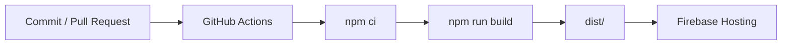

# Online Hosting Guide

BengtsToolBox wird als Vite-SPA über Firebase Hosting ausgeliefert. GitHub Actions baut bei Pushes auf `main` die Produktion und bei Pull Requests aus demselben Repository einen Preview Channel.

## Aktueller Deploy-Pfad



| Datei | Aufgabe |
| --- | --- |
| `.github/workflows/firebase-hosting.yml` | Produktion bei Push auf `main` oder manuellem Start |
| `.github/workflows/firebase-hosting-pull-request.yml` | Preview Channel für interne Pull Requests |
| `firebase.json` | Hosting-Quelle `dist`, SPA-Rewrite, Rules- und Indexpfade |
| `.firebaserc` | Firebase-Standardprojekt `bengtstoolbox` |
| `firestore.rules` | Zugriff für authentifizierte Nutzer unter `apps/**` |
| `firestore.indexes.json` | explizite Firestore-Indizes |

## Voraussetzungen

- Firebase-Projekt `bengtstoolbox` mit aktivem Hosting und Firestore
- aktivierter Firebase-Authentication-Anbieter **Anonymous**
- GitHub-Repository `Betogora/BengtsToolBox`
- Node.js 22+ für lokale Builds
- Firebase CLI nur für manuelle Infrastruktur-Deployments

## Laufzeitkonfiguration

Vite übernimmt die folgenden Werte beim Build. Lokal stehen sie in einer nicht versionierten `.env.local`; GitHub Actions liest sie aus Repository Secrets.

| Variable / Secret | Herkunft |
| --- | --- |
| `VITE_FIREBASE_API_KEY` | Firebase Web-App-Konfiguration |
| `VITE_FIREBASE_AUTH_DOMAIN` | Firebase Web-App-Konfiguration |
| `VITE_FIREBASE_PROJECT_ID` | Firebase Web-App-Konfiguration |
| `VITE_FIREBASE_STORAGE_BUCKET` | Firebase Web-App-Konfiguration |
| `VITE_FIREBASE_MESSAGING_SENDER_ID` | Firebase Web-App-Konfiguration |
| `VITE_FIREBASE_APP_ID` | Firebase Web-App-Konfiguration |

Lokales Setup:

```powershell
Copy-Item .env.example .env.local
```

Die Platzhalter anschließend durch die Werte aus **Firebase Console → Project settings → Your apps → Web app** ersetzen. Firebase Web-API-Keys sind Client-Konfiguration, trotzdem gehören die konkreten Projektwerte in diesem Repository ausschließlich in die vorgesehenen Umgebungsvariablen.

## GitHub-Konfiguration

Unter **Settings → Secrets and variables → Actions** werden benötigt:

### Repository Secrets

- alle sechs `VITE_FIREBASE_*`-Werte aus der Tabelle
- `FIREBASE_SERVICE_ACCOUNT_BENGTSTOOLBOX`: JSON des Service Accounts für Firebase Hosting

In ein Secret gehört nur der Wert, nicht `NAME=value`.

### Repository Variable

- `FIREBASE_PROJECT_ID=bengtstoolbox`

Der Produktionsworkflow liest die Projekt-ID aus dieser Variable. Der Preview-Workflow verwendet derzeit dieselbe Projekt-ID direkt.

## Erstinstallation oder Neuverknüpfung

Dieser Abschnitt ist nur nötig, wenn Firebase oder die GitHub-Verknüpfung neu aufgesetzt wird.

```powershell
npx firebase-tools login
npx firebase-tools use bengtstoolbox
npx firebase-tools init hosting:github
```

Beim Assistenten gelten:

- Repository: `Betogora/BengtsToolBox`
- Build: `npm ci && npm run build`
- Public directory: `dist`
- Single-page app: ja
- Produktionsbranch: `main`

Bereits vorhandene Workflow- und Firebase-Dateien nicht blind überschreiben; den erzeugten Stand mit diesem Repository vergleichen.

## Manuell verifizieren und deployen

Vor jedem manuellen Deployment:

```powershell
npm ci
npm run lint
npm run build
```

Hosting lässt sich bei Bedarf lokal ausrollen:

```powershell
npx firebase-tools deploy --only hosting
```

Firestore Rules und Indizes bilden einen separaten Infrastruktur-Deploy:

```powershell
npx firebase-tools deploy --only firestore:rules,firestore:indexes
```

Die GitHub-Workflows deployen aktuell nur Hosting. Rules und Indizes bleiben manuell, solange der GitHub-Service-Account keine bewusst vergebenen Firestore-/Rules-Rechte besitzt.

## Nach dem Deploy prüfen

1. Produktions- oder Preview-URL öffnen.
2. Eine verschachtelte Route direkt laden, zum Beispiel `/apps/scoreboard`; sie muss dank SPA-Rewrite funktionieren.
3. Eine synchronisierte App in zwei Fenstern öffnen und Realtime-Verhalten prüfen.
4. Browser-Konsole auf Auth-, Rules- und Netzwerkfehler kontrollieren.

## Fehlerdiagnose

| Symptom | Wahrscheinliche Ursache | Prüfung |
| --- | --- | --- |
| `npm ci` schlägt fehl | Lockfile und `package.json` divergieren | lokal `npm ci` ausführen |
| Build schlägt fehl | TypeScript-, Lint-unabhängiger Compile- oder Bundlefehler | `npm run build` |
| Workflow findet Projekt nicht | `FIREBASE_PROJECT_ID` fehlt oder ist falsch | GitHub Variable prüfen |
| Hosting-Deploy nicht autorisiert | Service-Account-Secret fehlt, ist ungültig oder unzureichend berechtigt | Secret und Firebase IAM prüfen |
| `auth/api-key-not-valid` | Web-App-Konfiguration fehlt oder Secret enthält zusätzlichen Text | `VITE_FIREBASE_API_KEY` prüfen |
| `Missing or insufficient permissions` | Anonymous Auth ist aus oder Rules sind nicht deployed | Auth-Anbieter und Rules-Deploy prüfen |
| Direkte Unterseite liefert 404 | SPA-Rewrite fehlt im aktiven Hosting-Ziel | `firebase.json` und Deploy prüfen |
| App läuft nur lokal | Firebase-Konfiguration war beim Build unvollständig | Workflow-Environment und synchronisierte App prüfen |

## Sicherheitsgrenze

Die aktuellen Rules erlauben jedem anonym authentifizierten Client Lesen und Schreiben unter `apps/{appId}/...`. Das passt zum privaten App-Hub, ist aber keine Mandanten- oder Rollenabsicherung. Vor einer öffentlichen Nutzung mit sensiblen Daten müssen Datenräume, Claims und Rules enger modelliert und mit Emulator- oder Rules-Tests abgesichert werden.
