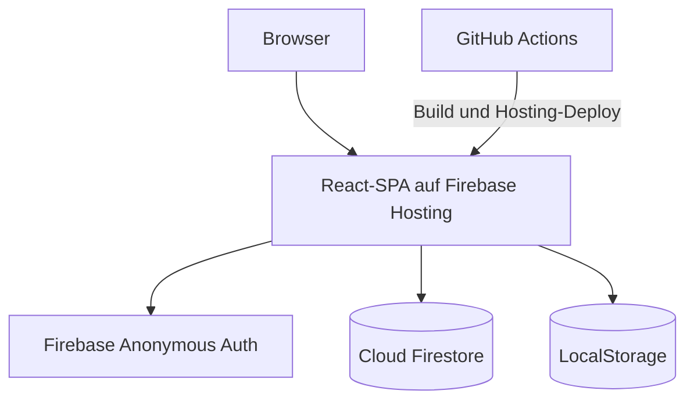
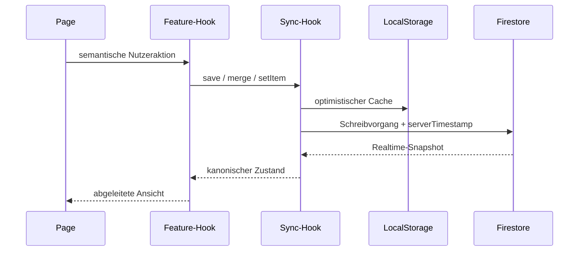

# BengtsToolBox – Produkt- und Systemspezifikation

> **Stand:** 11. Juli 2026
> **Status:** aus dem aktuellen Laufzeitcode rekonstruiert  
> **Geltungsbereich:** gesamtes Repository

Diese Datei ist die zentrale Spezifikation von BengtsToolBox. Sie vereint Produktumfang, fachliches Ist-Verhalten, Architekturregeln, Entwicklungsvertrag und Betrieb. Der aktuelle Code bleibt für Implementierungsdetails maßgeblich. Abweichungen zwischen Code und dieser Datei müssen im selben Änderungssatz behoben werden.

Die visuell aufbereitete Lesefassung steht in [`specs.html`](specs.html). Nachweisbare technische Lücken und sinnvolle nächste Schritte stehen getrennt in [`todo.md`](todo.md).

## 1. Produktauftrag

BengtsToolBox ist ein deutsch- und englischsprachiger App-Hub für private Spieleabende, Gruppen, Quizrunden und kleine Turniere. Die Anwendung stellt mehrere unabhängige Werkzeuge in einer gemeinsamen responsiven React-SPA bereit.

### 1.1 Ziele

- Werkzeuge ohne Konto- oder Einrichtungsdialog direkt nutzbar machen.
- Gemeinsame Zustände auf mehreren Geräten in Echtzeit synchronisieren, wenn Firebase konfiguriert ist.
- Dieselben Werkzeuge ohne Firebase lokal im Browser nutzbar halten.
- Bedienoberflächen für Mobilgeräte, Desktop und Presenter-/Beameransichten bereitstellen.
- Neue reguläre Apps über eine einzige Registry in Dashboard, Routing und Lazy Loading integrieren.
- Fachlogik, Darstellung und Persistenz so trennen, dass Änderungen lokal nachvollziehbar bleiben.

### 1.2 Bewusste Grenzen

- Es gibt keinen Application Server und keine Cloud Functions; Hosting, Anonymous Auth und Firestore bleiben im Spark-Tarif nutzbar.
- Es gibt keine persönlichen Konten, Rollen oder Mandanten.
- Anonymous Auth identifiziert eine Browsersitzung, autorisiert aber keine fachlichen Rollen.
- LocalStorage ist Fallback und Cache, keine vollständige Offline-Synchronisation oder Konfliktauflösung.
- Die Anwendung ist in der aktuellen Sicherheitskonfiguration für einen privaten Hub gedacht, nicht für sensible oder mandantengetrennte Daten.
- `Schlag den Raab` besitzt nur eine clientseitige Zugangsschranke; sie ist keine Sicherheitsgrenze.
- Öffentliche Lobbys besitzen keine Rollen: alle anonym authentifizierten Geräte dürfen ihren gemeinsamen App-Zustand bearbeiten.

## 2. Produktlandkarte und Routen

Das Dashboard unter `/` zeigt alle neun regulär registrierten Apps. Die Registry in `src/apps/registry.ts` ist die einzige Quelle für deren Metadaten, Routen und Lazy Loader. Der Sonderbereich `Schlag den Raab` ist bewusst nicht in der Registry enthalten.

| Bereich | Route | Registrierung | Kernzweck |
| --- | --- | --- | --- |
| Dashboard | `/` | Shell/Router | Einstieg, QR-Code und App-Kacheln |
| Glücksrad | `/apps/decision-wheel` | Registry | Gewichtete Zufallsauswahl |
| Coinflip | `/apps/coinflip` | Registry | Münzwurf mit Verlauf |
| Fortschritts-Dashboard | `/apps/progress-dashboard` | Registry | Ereignisbasierte Punktestände und Zeitverlauf |
| Scoreboard | `/apps/scoreboard` | Registry | Personen-, Team- und Änderungswertung |
| Live-Buzzer | `/apps/live-buzzer` | Registry | Transaktionssicherer Quiz-Buzzer |
| Sushi Map | `/apps/sushi` | Registry | Besuchte Länder und Bundesländer |
| Random Number Generator | `/apps/randomizer` | Registry | Zufällige Ganzzahl in einem Bereich |
| SK Anderten Turnier-App | `/apps/swiss-tournaments` | Registry | Swiss-, Rundenturnier-, Hand-and-Brain- und Mario-Kart-Turniere |
| Nächste Frage | `/apps/next-question` | Registry | Quizkarten mit verdeckter Antwort |
| Schlag den Raab | `/schlag-den-raab` | explizite Sonderroute | Zwei-Personen-Abendwertung |
| Lobbys | `/lobbies` | explizite Sonderroute | Öffentliche Räume erstellen und betreten |
| Lobby-Dashboard | `/lobbies/:lobbyId` | explizite Sonderroute | Alle regulären Apps innerhalb eines isolierten Raums |
| Lobby-App | `/lobbies/:lobbyId/apps/:appId` | Registry plus Lobby-Kontext | App-Zustand einer Lobby |
| Lobby-Verwaltung | `/lobby-admin` | explizite Sonderroute | PIN-geschützte Übersicht, Gerätehistorie und Löschung |

Alle App-Seiten werden lazy geladen. Das Dashboard stößt das Vorladen einer App bei Fokus, Hover oder Touch an. Firebase Hosting muss unbekannte Pfade auf `/index.html` umschreiben, damit direkte App-URLs funktionieren.

## 3. Globale Produktanforderungen

### 3.1 Shell und Navigation

- Die Shell zeigt Branding, Dashboard, `Schlag den Raab`, Lobbys und Sprachauswahl. Die Lobby-Verwaltung ist als sekundäre Aktion im Kopf der Lobby-Seite erreichbar.
- Auf mittleren und großen Breiten ist die Navigation direkt sichtbar; mobil liegt sie in einem Menü.
- Jede reguläre App erhält Titel, Beschreibung, Status, Icon, URL und Lazy Loader ausschließlich über die Registry.
- Sonderrouten dürfen nur verwendet werden, wenn ein Bereich bewusst nicht als normale Dashboard-App erscheint.

### 3.2 Sprache und Formatierung

- Unterstützte Sprachen sind Deutsch (`de-DE`) und Englisch (`en-GB`).
- Deutsch ist die Standardsprache.
- Die Auswahl wird unter `bengtstoolbox.language` in LocalStorage gespeichert und auf `document.documentElement.lang` gespiegelt.
- Beide Übersetzungskataloge müssen dieselben flachen Keys enthalten.
- Sichtbare UI-Texte, ARIA-Texte, Dialoge, Toasts und Empty/Error States laufen über `useI18n()`.
- Gespeicherte Eigennamen und fachliche Benutzereingaben werden nicht übersetzt.
- Datum, Uhrzeit und Zahlen werden über `Intl` mit der aktiven Locale formatiert.

### 3.3 Presenter-Modus

- Apps mit zuschauerrelevanter Ausgabe verwenden den gemeinsamen `PresenterLauncher`.
- Der Presenter ist ein read-only Fullscreen-Overlay; die normale Page bleibt die Steuerfläche.
- Ein einzelner View startet direkt, mehrere Views werden zuerst in einem Auswahlfenster angeboten.
- Der Modus versucht Browser-Fullscreen, bleibt aber als Overlay nutzbar, wenn Fullscreen blockiert wird.
- Escape beziehungsweise der sichtbare Beenden-Button schließen den Presenter und stellen den Fokus wieder her.
- Presenter verwenden aktuell: Glücksrad, Coinflip, Fortschritts-Dashboard, Scoreboard, Live-Buzzer, Sushi Map, Randomizer und Turnier-App.

### 3.4 UX und Barrierefreiheit

- Der erste Screen einer App zeigt das Werkzeug und keine Marketing-Landingpage.
- Die Oberfläche muss ab 320 Pixel Breite ohne unkontrolliertes horizontales Seiten-Scrolling funktionieren; fachlich breite Tabellen dürfen einen eigenen Scrollcontainer besitzen.
- Icon-only Buttons brauchen einen zugänglichen Namen.
- Formfelder brauchen sichtbare oder programmatisch verknüpfte Labels.
- Lade-, Leer-, Fehler- und lokaler Modus müssen verständlich darstellbar sein.
- Destruktive Aktionen benötigen eine angemessene Bestätigung.
- Farbe darf nie der einzige Informationsträger sein.
- Fokuszustände und Tastaturbedienung müssen sichtbar und funktionsfähig bleiben.
- Globale Typografie verwendet Manrope Variable und semantische `type-*`-Rollen aus `src/styles/globals.css`.
- Oberflächen bleiben standardmäßig kompakt und verzichten auf erklärende Untertitel. Untertitel werden nur auf ausdrücklichen Produktwunsch oder für notwendige Status- und Fehlermeldungen ergänzt.

## 4. Persistenz- und Synchronisationsvertrag

### 4.1 Betriebsarten

Die Firebase-Initialisierung gilt als vollständig, wenn mindestens API-Key, Auth-Domain, Projekt-ID und App-ID vorhanden sind.

**Realtime-Modus:**

1. Der Client meldet sich anonym an.
2. `useFirestoreDoc` oder `useFirestoreCollection` abonniert einen Firestore-Snapshot.
3. Schreibaktionen aktualisieren zuerst React State und LocalStorage.
4. Danach wird Firestore mit `updatedAt: serverTimestamp()` geschrieben.
5. Eingehende Snapshots sind der kanonische gemeinsame Zustand.

**Lokaler Modus:**

- Fehlt die Konfiguration, liefern dieselben Hooks Daten ausschließlich aus LocalStorage.
- Die lokale User-ID wird einmal erzeugt und unter `app-hub:local-user-id` gespeichert.
- Es gibt keine geräteübergreifende Synchronisation.

### 4.2 Gemeinsame Interfaces

| Bedarf | Interface | Verhalten |
| --- | --- | --- |
| einzelner Dokumentzustand | `useFirestoreDoc<T>` | `data`, `save`, `merge`, Loading, Fehler, Realtime-Flag |
| geordnete Elemente | `useFirestoreCollection<T>` | Setzen, Mergen, einzeln oder gesammelt Löschen, Sammelspeichern und Leeren; Standardreihenfolge `position` |
| Nutzerkennung | `useAnonymousSession` | Firebase UID oder lokale Fallback-ID |
| Lobby-Verzeichnis | `useLobbyDirectory` | Öffentliche Liste, Default-Lobby und transaktionssichere Erstellung |
| Aktive Lobby | `useActiveLobby` | Lobby aus dem Route-Kontext; außerhalb immer `default` |

LocalStorage-Schlüssel beginnen mit `app-hub:doc:` beziehungsweise `app-hub:collection:` und enthalten den vollständigen kanonischen Pfad.

### 4.3 Kanonische Firestore-Pfade

Firestore-Pfade dürfen nur in `src/lib/firebase/paths.ts` definiert werden.

| App | Dokumente | Collections |
| --- | --- | --- |
| Randomizer | `apps/randomizer/state/{stateId}` | – |
| Glücksrad | `apps/decision-wheel/state/{stateId}` | – |
| Coinflip | `apps/coinflip/state/{stateId}` | – |
| Nächste Frage | `apps/next-question/state/{stateId}` | – |
| Schlag den Raab | `apps/schlag-den-raab/sessions/{sessionId}/state/default` | – |
| Live-Buzzer | `apps/live-buzzer/sessions/{sessionId}/state/default` | `.../players` |
| Scoreboard | `apps/scoreboard/sessions/{sessionId}/state/default` | `.../players`, `.../teams`, `.../scorings`, `.../events` |
| Fortschritts-Dashboard | `apps/progress-dashboard/sessions/{sessionId}/state/default` | `.../players`, `.../datasets` |
| Sushi Map | `apps/territory-map/sessions/{sessionId}/state/default` | `.../players`, `.../datasets` |
| Turnier-App | `apps/swiss-tournaments/sessions/{sessionId}/state/default` | `.../tournaments` |

Alle Hooks verwenden außerhalb eines Lobby-Kontexts weiterhin `default`. In einer Lobby kapseln sie ihre Daten unter `lobbies/{lobbyId}/apps/{appId}/...`; Metadaten liegen in `lobbies/{lobbyId}`, Gerätezugriffe in `lobbies/{lobbyId}/devices/{uid}`. Die globale Lobby behält bewusst alle bestehenden `apps/...`-Pfade und benötigt keine Datenmigration.

### 4.4 Öffentliche Lobbys

- Firebase Anonymous Auth ist die Geräteidentität; es gibt keine Konten, Passwörter, Besitzer- oder Teilnehmerrollen.
- Lobbycodes bestehen aus sechs Großbuchstaben/Ziffern ohne `0`, `O`, `1` und `I`. Eine Firestore-Transaktion verhindert Kollisionen.
- Lobby- und Gerätenamen sind auf 60 beziehungsweise 40 Zeichen begrenzt.
- Jedes Gerät darf ausschließlich `devices/{request.auth.uid}` schreiben. Erster und letzter Zugriff werden gespeichert; `lastSeenAt` wird clientseitig höchstens alle fünf Minuten aktualisiert.
- Alle authentifizierten Geräte dürfen eine aktive Lobby sowie ihre App-Zustände lesen und bearbeiten. Die Gerätehistorie ist technisch ebenfalls für authentifizierte Clients lesbar, wird aber nur hinter der clientseitigen Verwaltungs-PIN angezeigt.
- `default` ist sichtbar und nicht löschbar. Benutzerdefinierte Lobbys werden beim Entfernen mit einem Löschmarker dauerhaft deaktiviert; ihre Unterdaten bleiben gespeichert, sind durch Rules aber nicht mehr les- oder beschreibbar und ihr Code wird nicht wiederverwendet.
- Ohne Firebase bleiben die globalen Apps lokal nutzbar; Lobby-Liste, Erstellung und Verwaltung melden die fehlende Konfiguration.

### 4.5 Konsistenz und Fehler

- Schreibvorgänge sind lokal optimistisch.
- Der gemeinsame Cache löst keine konkurrierenden Änderungen auf; in Realtime ist der letzte kanonische Snapshot maßgeblich.
- Mehrere Dokumente oder Collections werden nicht automatisch atomar geändert.
- Der Live-Buzzer verwendet für den Gewinner-Buzz ausdrücklich eine Firestore-Transaktion.
- Auth-, Rules-, Netzwerk- und Snapshotfehler werden als `Error` an das jeweilige Feature weitergereicht.
- Features dürfen keine eigenen Firebase-Apps, Auth-Flows oder separaten LocalStorage-Fallbacks einführen.

## 5. App-Spezifikationen

### 5.1 Glücksrad

**Zweck:** Optionen verwalten und proportional zu einem Gewicht zufällig auswählen.

- Initial existieren drei Optionen mit Gewicht `1` und Farben aus der globalen Palette.
- Optionen können hinzugefügt, umbenannt, eingefärbt, gewichtet und entfernt werden.
- Gewichte werden auf ganze Zahlen gerundet und sind mindestens `1`.
- Leere Anzeigetexte fallen auf `Option {n}` zurück.
- Die Gewinnchance entspricht `Gewicht / Summe aller Gewichte`.
- Das Drehergebnis wird vor der Animation erzeugt und nach dem visuellen Abschluss gespeichert.
- Eine Drehung dauert 4,4 Sekunden plus 150 Millisekunden Settle-Zeit.
- Letztes Ergebnis und maximal fünf Verlaufseinträge werden gespeichert.
- Der Verlauf kann gelöscht; alle Optionen können auf die drei Beispiele zurückgesetzt werden.
- Der Presenter zeigt Rad, Ergebnis und Verlaufsumfang.

### 5.2 Coinflip

**Zweck:** fairer Zwei-Seiten-Münzwurf mit sichtbarer Animation.

- Seiten sind `Kopf` und `Zahl`.
- Wenn verfügbar, wird `crypto.getRandomValues` verwendet; andernfalls `Math.random`.
- Die Münze absolviert sechs volle Rotationen; die Animation dauert 1,7 Sekunden plus 120 Millisekunden Settle-Zeit.
- Ergebnis, Zeitstempel, letztes Ergebnis und maximal zehn Verlaufseinträge werden gespeichert.
- Der Verlauf kann vollständig zurückgesetzt werden.
- Der Presenter zeigt das letzte Ergebnis und die fünf neuesten Verlaufseinträge.

### 5.3 Random Number Generator

**Zweck:** zufällige Ganzzahl in einem frei wählbaren inklusiven Bereich.

- Standardbereich ist `1` bis `6`.
- Eingaben werden auf Ganzzahlen abgerundet; ungültige Werte fallen auf `1` beziehungsweise `6` zurück.
- Vertauschte Grenzen werden automatisch als kleinere und größere Grenze gespeichert.
- Die Ziehung ist inklusiv: Minimum und Maximum können beide auftreten.
- Die Zufallsquelle ist `Math.random`.
- Letztes Ergebnis und maximal fünf Verlaufseinträge werden gespeichert.
- Der Verlauf kann gelöscht werden, ohne den Bereich zurückzusetzen.
- Der Presenter zeigt Bereich, letztes Ergebnis und Verlauf.

### 5.4 Nächste Frage

**Zweck:** Quizkarten nacheinander präsentieren, ohne die Antwort vorzeitig zu zeigen.

- Der statische NDJSON-Datensatz enthält 5.044 Fragen in zehn Kategorien.
- Jede Frage benötigt ID, Kategorie, Frage und Antwort; ungültige Datensätze verhindern das Laden.
- Der Katalog wird beim Öffnen der App als gehashtes NDJSON-Asset geladen und langfristig per HTTP sowie für die laufende Sitzung im Speicher gecacht. Ohne Service Worker bleibt Offline-Nutzung nach einem erfolgreichen Abruf best-effort; ein nicht verfügbarer Katalog zeigt einen wiederholbaren Fehlerzustand.
- Gespeichert werden Kartenposition und Sichtbarkeit der Antwort, nicht der Fragenkatalog.
- Vor und Zurück laufen zyklisch über Anfang und Ende des Katalogs.
- Ein direkter Sprung verwendet eine 1-basierte Kartennummer und begrenzt sie auf den gültigen Bereich.
- Jeder Kartenwechsel verbirgt die Antwort wieder.
- Die primäre Aktion zeigt zuerst die Antwort und wechselt beim nächsten Auslösen zur folgenden Frage.
- Tastatursteuerung unterstützt die primäre Aktion und Navigation.

### 5.5 Scoreboard

**Zweck:** Personen und Teams während eines Spieleabends bewerten.

- Der erste Start erzeugt ein direkt nutzbares Einzel-Scoring mit zwei Spielern sowie zwei vorbereiteten Teams. Spieler-, Team-, Scoring- und Ereignis-IDs sind stabil und nicht aus Namen oder Positionen abgeleitet.
- Ein Scoring wertet entweder Spieler oder Teams. Die Wertungsart bleibt bis zur ersten Buchung umschaltbar und ist danach für dieses Scoring gesperrt.
- Im Teammodus können Punkte direkt auf Teams oder auf einzelne Spieler gebucht werden. Spielerbuchungen erhöhen zugleich den persönlichen Score und den Score des zum Buchungszeitpunkt zugeordneten Teams; spätere Teamwechsel verschieben frühere Punkte nicht. Direkte Teambuchungen bleiben als nicht personengebundene Korrekturen möglich.
- Scores sind ganze Zahlen und dürfen negativ werden. Änderungen um `0` sowie Dezimalwerte werden blockiert.
- Jede erfolgreiche Buchung ist ein eigenes Collection-Dokument mit Scoring, Ziel-ID, Zieltyp, Name/Farbe als Snapshot, optional gutgeschriebener Team-ID, Delta und Clientzeit. Scores und Verlauf werden ausschließlich daraus abgeleitet.
- Die Eingabereihenfolge bleibt stabil. Die Spielerliste gruppiert nach fester Teamreihenfolge, sortiert innerhalb der Teams nach persönlichem Score und führt nicht zugeordnete Spieler zuletzt. Ranglisten sortieren nach Score und vergeben geteilte Ränge nach `1, 1, 3`; ab drei Zielen zeigt die UI zusätzlich relative Rangbalken mit Nullachse.
- Namen, Farben und Teamzuordnungen bleiben editierbar. Bewertete Score-Ziele können im aktiven Scoring nicht gelöscht werden; Einzel- und Teamwertung behalten jeweils mindestens zwei Ziele.
- Der vollständige Verlauf ist vollbreit und eingeklappt. Die jüngste Buchung kann rückgängig gemacht werden.
- „Archivieren und neu starten“ friert Spieler, Teams und Ereignisse des alten Scorings ein und startet mit derselben Aufstellung bei `0`. Archive sind umbenennbar, lesbar und samt Ereignissen löschbar.
- Automatische Scoringnamen verwenden den lokalen Starttag ohne Uhrzeit. Mehrere Scorings desselben Tages werden appweit chronologisch mit römischen Suffixen nummeriert; manuelle Namen bleiben unverändert.
- Der Presenter ist read-only und zeigt bei zwei Zielen eine große Gegenüberstellung, ab drei Zielen die Rangansicht.
- Schema-Version `2` ist ein bewusster destruktiver Schnitt: Beim ersten Öffnen pro globalem oder Lobby-Datenraum werden der alte State und die alte Spieler-Collection gelöscht und durch die neue Initialbelegung ersetzt.

### 5.6 Live-Buzzer

**Zweck:** mehrere Geräte als Quiz-Buzzer mit eindeutiger Gewinnerermittlung verwenden.

- Jeder Browser erhält eine dauerhafte lokale Player-ID und automatisch eine Spielerkarte.
- Spieler besitzen Name, Position, optional Team Blau/Gelb und Buzz-Zeitpunkt.
- Eine Runde kann geöffnet, gesperrt oder zurückgesetzt und unmittelbar wieder geöffnet werden.
- Beim Öffnen werden sichtbare Buzzes gelöscht, die Rundennummer erhöht und der Gewinner zurückgesetzt.
- Nur aktive Spieler dürfen in einer offenen Runde buzzern; jeder Spieler höchstens einmal.
- Im Firebase-Modus entscheidet eine Firestore-Transaktion, welcher Buzz zuerst den noch freien Gewinner setzt.
- Spätere gültige Buzzes bleiben für die Reihenfolge sichtbar, ändern aber den Gewinner nicht.
- Im lokalen Modus wird dieselbe Gewinnerregel ohne geräteübergreifende Atomarität ausgeführt.
- Die Buzzreihenfolge wird aus Server-Timestamp beziehungsweise Client-ISO-Zeit abgeleitet.
- Maximal fünf Rundengewinner bleiben im Verlauf.
- Entfernt ein Browser seine eigene Spielerkarte, erhält er automatisch eine neue Identität.
- Optionaler Sound und Presenter-Liveansicht sind reine UI-Zustände.

### 5.7 Fortschritts-Dashboard

**Zweck:** wiederkehrende Ereignisse pro Person erfassen und als Stand sowie Zeitreihe darstellen.

- Initial existieren fünf Personen mit stabiler Position, Farbe und Standardereignis `Bier`.
- Ereignistypen sind Plus, Minus, Wein, Bier, Schnaps und Trichter.
- Wein, Bier und Trichter zählen standardmäßig `1`; Schnaps zählt `0,5`.
- Events speichern Personensnapshot, Farbe, Delta, Icon, Zeit und Position.
- Der Score wird chronologisch aus Events berechnet und niemals unter `0` abgesenkt.
- Namen, Farben und Standard-Getränkeicon einer Person sind editierbar.
- Das Entfernen einer Person löscht vorhandene Events nicht; Archive können Personen daraus rekonstruieren.
- Eventzeit, Icon und Wert können korrigiert; Events können gelöscht werden.
- Ein Datensatz besitzt Name, Diagrammtitel, Einheit, Status und Events.
- Änderungen der Einheit aktualisieren einen noch automatisch abgeleiteten Diagrammtitel mit.
- „Archivieren und neu starten“ kopiert den aktiven Datensatz mit Datumsnamen ins Archiv und erzeugt einen leeren aktiven Datensatz. Mehrere Archive desselben lokalen Tages erhalten chronologische römische Suffixe; manuelle Namen bleiben unverändert.
- Archive können umbenannt und gelöscht werden.
- Desktop zeigt ein interaktives Zeitdiagramm; mobil stehen Rang- und Timeline-Ansichten bereit.
- Der Presenter zeigt Stand, Führung, Eventzahl und Gesamtscore.

### 5.8 Sushi Map

**Zweck:** Sushi-Besuche in Weltländern und deutschen Bundesländern Personen zuordnen.

- Kartenräume sind Weltkarte mit 241 Territorien und Deutschlandkarte mit 16 Bundesländern.
- Initial existieren Bengt, Paul und `Sushi-Tourist 3` mit unterschiedlichen Farben.
- Die ersten zwei Personen können nicht entfernt werden; weitere Touristen sind anleg- und löschbar.
- Ein Besuch speichert Karte, Territorium, Personensnapshot, Farbe, Zeit und Position als Event.
- Der aktuelle Claim eines Territoriums stammt aus dessen jüngstem lokalen Kalendertag.
- Mehrere Personen können am selben jüngsten Tag gemeinsame Owner desselben Territoriums sein.
- „Unbesucht“ löscht alle Events des jüngsten Claim-Tages dieses Territoriums, nicht die ältere Historie.
- Eventdatum, Person und Territorium können korrigiert; einzelne Events können gelöscht werden.
- Namens- und Farbänderungen aktualisieren die Events des aktiven Datensatzes.
- Die Rangliste zählt pro Person alle aktuell gehaltenen Welt- und Deutschland-Claims.
- Zehn Achievements werden aus der Besuchshistorie abgeleitet, unter anderem Afrika, Deutschland, Nordics, Balkan, Amerika, Pazifik, Microstates, Japan und Berlin.
- Die Karte unterstützt Tastaturauswahl, Pointer-Drag, Pinch/Zoom und Zoomstufen `1`, `2`, `4`.
- Der Presenter zeigt aktive Karte, Claims, Legende und Rangliste.

### 5.9 SK Anderten Turnier-App

**Zweck:** kleine Turniere mit Paarungsgenerierung, Ergebnissen, Rangliste, Archiv und Export verwalten.

#### Gemeinsames Turniermodell

- Formate sind `Swiss`, `Round Robin`, `Hand and Brain` und `Mario Kart`.
- Spieler besitzen Namen, optionales Rating, initialen Seed, Status und Eintrittsrunde.
- Statuswerte sind aktiv, inaktiv und zurückgezogen. Zwischen allen drei Werten kann frei gewechselt werden; nur aktive Spieler werden neu ausgelost. Overrides können ab einer bestimmten Runde gelten.
- Seeding nach Rating sortiert absteigend. Der Modus „zufällig“ verwendet aktuell eine stabile Hash-Reihenfolge aus Name und Rating.
- Eine Runde ist `draft` oder `completed`. Bei Mario Kart können mehrere Draft-Runden als aktive Lobbys parallel bestehen; die übrigen Formate verändern nur die jüngste Draft-Runde.
- Eine Runde kann erst abgeschlossen werden, wenn alle Pairings vollständig gewertet sind.
- Neue aktive Turniere archivieren alle vorher aktiven Turniere.
- Reset archiviert eine Kopie und setzt Runden, Fortschritt und Spielerstatus des aktiven Turniers zurück.
- Automatische Turniernamen verwenden den lokalen Starttag ohne Uhrzeit. Mehrere Turniere desselben Tages werden formatübergreifend chronologisch mit römischen Suffixen nummeriert; manuelle Namen bleiben unverändert.
- Turniere und Archive können als Ranglisten-CSV exportiert und über die Druckansicht als PDF ausgegeben werden.
- Der Presenter zeigt die aktuelle Rangliste.

#### Ergebnisse und Rangfolge

- Standardresultate sind `1-0`, `0-1`, `½-½` und kampflose Siege.
- Bye-Wertungen sind `1`, `0,5` oder `0` und können pro Runde überschrieben werden.
- Nicht-Mario-Kart-Rangfolge: Punkte, Buchholz, Sonneborn-Berger, Siege, direkter Vergleich, initialer Seed.
- Mario-Kart-Rangfolge: Turnierpunkte, Siege, bessere Durchschnittsplatzierung und direkter Vergleich. Vollständig gleiche sportliche Werte teilen sich den Rang nach `1, 1, 3`; Seed und Name stabilisieren nur die Anzeige.
- Ergebniskorrekturen dürfen eine noch ungewertete aktuelle Draft-Runde neu generieren; die UI muss davor warnen.
- Manuell fixierte Pairings bleiben bei einer Regenerierung erhalten, solange sie gültig sind. Mario-Kart-Fixierungen beziehen sich stattdessen auf eine noch nicht erzeugte zukünftige Lobby.

#### Swiss

- Runde 1 paart obere gegen untere Seed-Hälfte.
- Spätere Runden bilden Scoregruppen, verwenden bei Bedarf Floater und minimieren Punktdifferenzen.
- Wiederholungen werden vermieden, solange eine vollständige wiederholungsfreie Paarung existiert.
- Ist das nicht möglich, wird ein Vereins-Fallback mit harter Warnung erzeugt.
- Bei ungerader Spielerzahl erhält eine Person ein Bye. Bevorzugt werden wenige bisherige Härten, niedriger Score und niedriger Seed; die Policy kann Neueinsteiger schützen.
- Farben werden auf Wechsel, Serien von drei gleichen Farben und Gesamtdifferenz optimiert.

#### Round Robin

- Der Grundplan verwendet das Berger-System; bei ungerader Spielerzahl entsteht ein Dummy-Slot mit Bye.
- Ein oder mehrere Durchgänge sind möglich; Folgedurchgänge invertieren Farben.
- Die Rundenzahl ergibt sich aus aktiven Spielern und Durchgängen.
- Spieleränderungen werden durch Reparatur-Pairings ergänzt; bis 16 Spieler kann eine begrenzte exakte Suche verwendet werden.
- Kein Paar darf häufiger als die Zielzahl der Durchgänge gegeneinander spielen.

#### Hand and Brain

- Ein vollständiges Brett besteht aus vier verschiedenen Personen: je Hand und Brain auf Weiß und Schwarz.
- Der Generator gruppiert vorrangig nach Score und optimiert Teampaarungen, Rollenwechsel und Farbausgleich.
- Wiederholte Team-gegen-Team-Konstellationen sind harte Warnungen; wiederholte Partner oder Rollen sind Hinweise.
- Restklassen werden behandelt: bei Rest `1` oder `3` entsteht ein Bye, bei Rest `2` zusätzlich eine Einzelpartie.
- Bye und Einzelpartie werden gemeinsam als Härten fair verteilt.

#### Mario Kart

##### Fachbegriffe

| Begriff | Bedeutung |
| --- | --- |
| Wertungsrunde | Fachlicher Durchlauf, in dem jeder teilnahmeberechtigte Fahrer höchstens eine Wertung erhält. Eine Wertungsrunde kann sich über mehrere Lobbys erstrecken. |
| Lobby | Ein einzelnes Mario-Kart-Rennen mit genau vier Fahrern. Die Bezeichnung `2.1` meint die erste Lobby mit offenen Wertungen für Wertungsrunde 2. |
| Wertung | Zuordnung einer Lobbyteilnahme zu genau einer Wertungsrunde. Nur abgeschlossene Wertungen beeinflussen Turnierpunkte, Siege und Durchschnittsplatz. |
| Füller | Fahrer, der eine nicht volle Lobby ergänzt und dessen Ergebnis bereits einer späteren Wertungsrunde zugerechnet wird. |
| Extra | Fahrer, dessen Teilnahme derzeit keiner Wertungsrunde zugeordnet ist. Das Ergebnis bleibt ungewertet, bis eine spätere Bonus-Wertungsrunde es gegebenenfalls übernimmt. |
| Aktive Lobby | Ausgeloste, noch nicht vollständig gewertete Lobby. Ihre Fahrer sind für weitere aktive Lobbys reserviert. |
| Geschlossene Lobby | Lobby mit vier gültigen, eindeutigen Platzierungen. Sie reserviert keine Fahrer mehr und kann kontrolliert korrigiert werden. |

- Eine technische Runde entspricht genau einer Lobby mit exakt vier Fahrern. Die fachliche Wertungsrunde und die laufende Lobby werden als `Lobby 2.1` dargestellt.
- „Neue Lobby“ erzeugt pro Klick genau eine Aufstellung. Mehrere Lobbys dürfen aktiv sein, aber kein Fahrer darf gleichzeitig in zwei aktiven Lobbys sitzen.
- Aktive Wertungszuweisungen werden bereits für weitere Auslosungen berücksichtigt, beeinflussen Turnierpunkte, Siege und Durchschnittsplatz aber erst nach dem Abschluss.
- Die Auswahl priorisiert die älteste offene Wertungsrunde, ähnliche Turnierpunkte, wenige Gegnerwiederholungen, faire Füllereinsätze und ähnliche Durchschnittsplätze. Der Seed entscheidet nur die letzte deterministische Sortierung.
- Fehlen Fahrer für eine volle Lobby, werden Fahrer mit ihrer Wertung für die nächste geplante Wertungsrunde vorgezogen. Diese Füller werden dort nicht erneut eingeplant.
- Genau eine zukünftige Lobby kann mit zwei bis vier eindeutigen Fahrern fixiert werden. Die ausgewählten Fahrer warten aufeinander, bis sie aktiv und nicht anderweitig reserviert sind; andere Lobbys können währenddessen weiterlaufen. Freie Plätze werden regulär ergänzt. Fixierte Fahrer erhalten keine zusätzliche Wertung und tragen den Füller-Hinweis nur dann zusätzlich, wenn ihre nächste Wertungsrunde tatsächlich vorgezogen wird.
- Erst wenn keine weitere geplante Wertungsrunde existiert, ergänzen echte Extras mit `scoringCycleNumber: null` die Lobby. Extras bleiben bis zu einer möglichen späteren Bonus-Wertungsrunde ohne Turnierwertung.
- Beim Start einer Bonus-Wertungsrunde bleibt die konfigurierte Rundenzahl unverändert. Geeignete frühere Extras werden chronologisch rückwirkend dieser Bonusrunde zugeordnet und alle Wertungsstatistiken neu abgeleitet.
- Platzierungen werden als Zahlen `1` bis `24` erfasst und müssen innerhalb einer Lobby vollständig und eindeutig sein. Für Turnierpunkte und Siege zählt ihre relative Reihenfolge unter den vier menschlichen Fahrern; der tatsächliche Platz bleibt für den Durchschnitt erhalten. Mit der vierten gültigen Platzierung schließt die Lobby automatisch, Ranglisten und Turnierfortschritt werden unmittelbar aktualisiert.
- Geschlossene Lobbys können lokal bearbeitet und nur mit vier gültigen Plätzen atomar gespeichert werden; spätere Aufstellungen bleiben unverändert.
- Nur die jüngste vollständig ergebnislose aktive Lobby darf neu erzeugt oder gelöscht werden. Neu erzeugen übernimmt zwischenzeitliche Neuzugänge und Statusänderungen; eine enthaltene Fixierung bleibt erhalten.
- Inaktive und zurückgezogene Fahrer bleiben ausgeschlossen, bis sie reaktiviert werden. Währenddessen verpasste Wertungsrunden werden bewusst übersprungen und nicht nachgeholt; eine bereits aktive Lobby bleibt bis zum Neu-Erzeugen unverändert.
- Späteinsteiger erhalten ab ihrer Eintrittsrunde höchstens eine Wertung pro verbleibender konfigurierter Wertungsrunde. Der Turnierabschluss wird pro Wertungsrunde aus abgeschlossenen, übersprungenen und vor Eintritt liegenden Zuweisungen abgeleitet und benötigt keine Bonus-Lobby.
- Turnierpunkte nach relativer Platzierung der wertenden Fahrer: 4er `1 / 0,7 / 0,3 / 0`, 3er `1 / 0,5 / 0`, 2er `1 / 0`; ein einzelner wertender Fahrer neben Extras erhält `1`.
- Pro Fahrer kann optional ein Bier markiert werden. Die Markierung bleibt auch nach Lobbyabschluss direkt änderbar und beeinflusst weder Platzierung noch Lobby-Lebenszyklus. Gleiche Bieranzahlen teilen sich ebenfalls den Rang nach `1, 1, 3`.
- Rangliste, Presenter, Druckansicht und CSV verwenden dieselbe sportliche Reihenfolge und weisen physische sowie wertende Rennen getrennt aus.

#### Warnmodell

Pairings tragen harte oder weiche Warnungen. Abgedeckt werden unter anderem fehlende/inaktive/mehrfach verwendete Spieler, Wiederholung, Scoregruppen-Floater, zu große Punktdifferenz, Farbe, wiederholte Hand-and-Brain-Teams und -Rollen, unausgeglichene Mario-Kart-Lobbys sowie erneute Bye-Zyklen.

### 5.10 Schlag den Raab

**Zweck:** zwei Personen über 15 aufsteigend gewichtete Spiele und bei Bedarf ein Stechen bewerten.

- Der Bereich liegt außerhalb der Dashboard-Registry und ist über `/schlag-den-raab` erreichbar.
- Eine clientseitig fest codierte PIN schaltet die Route für die aktuelle `sessionStorage`-Sitzung frei. Dies verhindert keine technische Umgehung.
- Es existieren genau zwei Personen; Namen sind editierbar.
- Die 15 regulären Spiele tragen die Punkte `1` bis `15`; Titel sind editierbar.
- Ein Klick setzt oder entfernt den Gewinner eines Spiels und berechnet den kumulierten Score.
- Ein regulärer Sieger steht fest, sobald eine führende Person mehr als 60 Punkte besitzt.
- Sind nach allen 15 Spielen beide Scores gleich, erscheint Spiel 16 als Stechen mit 16 Punkten.
- Reset archiviert den gesamten Abend, behält die aktuellen Spielernamen und startet mit leeren Ergebnissen.
- Automatische Archivnamen verwenden den lokalen Archivtag ohne Uhrzeit. Mehrere Archive desselben Tages erhalten chronologische römische Suffixe; manuelle Namen bleiben unverändert.
- Archive sind umbenennbar, lesbar und löschbar.

## 6. Architektur

### 6.1 Systemkontext



Vite baut statische Dateien, Firebase Hosting liefert sie aus. Die gesamte Online-Persistenz einschließlich der bewusst einfachen Lobby-Verwaltung läuft direkt über Firestore-Clientzugriffe und bleibt Spark-kompatibel.

### 6.2 Schichten und Verantwortungen

| Bereich | Verantwortung | Darf nicht übernehmen |
| --- | --- | --- |
| `src/app` | Router, Lazy Routes, globale Provider | App-Fachlogik |
| `src/components/layout` | Shell und Dashboard | Persistenzlogik |
| `src/apps/registry.ts` | Metadaten und Loader regulärer Apps | Feature-Zustand |
| `src/apps/<app-id>` | UI, Hook, Typen und Fachlogik eines Features | eigene Firebase-Initialisierung |
| `src/apps/shared` | tatsächlich appübergreifende Modelle und Interaktionen | app-spezifische Sonderfälle |
| `src/components/ui` | generische UI-Primitiven | Geschäftslogik |
| `src/lib/firebase` | Client, Auth, Pfade, Sync und lokaler Cache | UI oder App-Regeln |
| `src/lib/i18n` | Sprache, Interpolation und Formatierung | fachliche Zustandsmigration |
| `src/lobbies` | Lobby-Domain, Context, Verzeichnis, Geräte-Tracking und clientseitige Verwaltungs-UI | app-spezifische Fachlogik |
| `src/styles` | globale Tokens, Typografie, Druckregeln | Feature-Zustand |

Abhängigkeiten zeigen von Page über Feature-Hook und pure Fachlogik zur gemeinsamen Infrastruktur. Gemeinsame Infrastruktur importiert keine App.

### 6.3 Typischer Datenfluss



### 6.4 Architekturentscheidungen

1. **Kein globaler State-Manager:** Feature-Hooks und Firestore-Snapshots decken den aktuellen Bedarf.
2. **Keine app-eigenen Firebase-Clients:** Eine Initialisierung verhindert divergierende Auth- und Cachezustände.
3. **Registry für reguläre Apps:** Navigation, Dashboard, Routing und Code-Splitting bleiben konsistent.
4. **Explizite Sonderrouten:** Versteckte oder anders strukturierte Bereiche werden nicht künstlich in die Registry gezwungen.
5. **Feature-lokale Wiederverwendung zuerst:** Shared Code entsteht erst bei echter Mehrfachnutzung.
6. **Pure Fachlogik außerhalb React:** Besonders Turnier-, Zufalls- und Auswertungsregeln bleiben unabhängig von UI und Persistenz.
7. **Code ist Detailquelle:** Dokumentation hält stabile Verträge fest und darf keine zweite, veraltete Implementierungserzählung werden.

## 7. Entwicklungsvertrag

### 7.1 Aufbau eines Features

Ein Feature besitzt nur die Dateien, die es tatsächlich benötigt:

```text
src/apps/<app-id>/
├── <AppName>Page.tsx
├── hooks/use<AppName>.ts
├── types.ts
├── logic.ts oder weitere pure Module   # optional
├── *.test.ts                           # optional, feature-nah
├── components.tsx                      # optional
├── data/                               # optional für große statische Daten
└── index.ts
```

- **Page:** Layout, Darstellung, Eingaben und Aufruf semantischer Aktionen.
- **Hook:** Zustand, Normalisierung, abgeleitete Werte, Aktionen und Persistenz.
- **Pure Module:** komplexe Regeln ohne React oder Firebase.
- **Index:** kleine öffentliche Feature-Interface.

### 7.2 Neue reguläre App integrieren

1. Kernaktion, Zustandsmodell, Lade-, Leer-, Fehler- und Wiederöffnungsverhalten festlegen.
2. Feature lokal anlegen und eine öffentliche Page über `index.ts` exportieren.
3. Bestehende UI-Primitiven, App-Layouts und echte Shared Modules wiederverwenden.
4. Persistenzbedarf als Dokument, geordnete Collection oder flüchtigen React State einordnen.
5. Neue Firestore-Pfade ausschließlich in `src/lib/firebase/paths.ts` ergänzen.
6. Sichtbare Texte in beiden Übersetzungskatalogen anlegen.
7. Reguläre App genau einmal in `src/apps/registry.ts` registrieren.
8. Mobile Bedienung, Tastatur, ARIA, Fehler, lokalen Modus und Destruktivbestätigungen prüfen.
9. Lint, automatisierte Tests, Build und risikogerechte Laufzeittests ausführen.

### 7.3 Code- und UI-Regeln

- Aktionen heißen fachlich (`addPlayer`, `finishRound`) und leaken keine Speicheroperationen in die Page.
- Initialwerte von Sync-Hooks bleiben referenziell stabil.
- Firestore-Serverzeit wird zentral geschrieben; Features dürfen ergänzende Client-ISO-Zeiten für Anzeige und Fallback speichern.
- Lucide Icons, globale Tokens und gemeinsame Controls werden bevorzugt.
- Feature-Layout bleibt in Komponenten; neue globale CSS-Regeln sind die Ausnahme.
- Presenter-Views bleiben read-only.
- Komplexe Regeln werden über ihr öffentliches Interface getestet; interne Implementierungsdetails sind keine eigene Testoberfläche.

### 7.4 Testsystem

Vitest läuft in einer Node-Umgebung und prüft pure Fachlogik ohne DOM, React-Renderer oder Firebase-Emulator. Tests liegen feature-nah als `*.test.ts`; ausschließlich gemeinsam genutzte feste Turnier-Fixtures liegen unter `src/apps/swiss-tournaments/__tests__`. Produktion und Tests verwenden dieselben öffentlichen Interfaces.

Der P0-Testschnitt umfasst:

- Golden Cases für Swiss, Round Robin, Hand and Brain und Mario Kart;
- Turnierlebenszyklus, Byes, Statuswechsel, Ergebniskorrekturen, Bonusrennen, Rangfolgen und Fortschritt;
- Randomizer, Glücksrad und Münzwurf mit injizierbaren Zufallsquellen;
- fachliche Utilities für wertende Teilnehmer und Glücksrad-Eingaben.

Zufällige IDs und Zeitstempel sind keine Golden Values. Fixtures verwenden feste IDs und Ergebnisse; Assertions prüfen beobachtbare Paarungen, Rollen, Punkte, Warnungen und Zustandsübergänge. Neue Zufallslogik akzeptiert eine kleine feature-lokale Zufallsfunktion und behält `Math.random` beziehungsweise Web Crypto als Produktionsstandard.

```powershell
npm test
npm run test:watch
npm run test:coverage
```

`npm test` läuft einmalig und ist der Befehl für CI. `npm run test:watch` dient der lokalen Entwicklung. `npm run test:coverage` erzeugt einen nicht versionierten Text- und HTML-Bericht unter `coverage/`. Es gibt zunächst kein prozentuales Coverage-Gate; die dokumentierte Szenariomatrix ist das Abnahmekriterium. Browser-, Komponenten-, Firebase-Emulator- und Rules-Tests gehören nicht zu diesem P0-Schnitt.

### 7.5 Verifikation und Definition of Done

Mindestens für Codeänderungen:

```powershell
npm run lint
npm test
npm run build
```

Bei Firebase- oder Sync-Änderungen zusätzlich:

1. ohne `.env.local` im lokalen Modus prüfen;
2. mit Firebase dieselbe App in zwei Fenstern prüfen;
3. Reload und Persistenz prüfen;
4. Auth-, Rules-, Netzwerk- und sichtbare Fehlerzustände prüfen.

Eine Änderung ist fertig, wenn Registry oder Sonderroute korrekt, Persistenz zentral, gemeinsamer Code nicht dupliziert, UI-Zustände verständlich und Lint, Tests sowie Build erfolgreich sind. Dokumentation wird nur angepasst, wenn sich dauerhafter Kontext oder ein spezifiziertes Verhalten ändert.

## 8. Lokale Entwicklung

Voraussetzung ist Node.js 22 oder neuer. Der reservierte lokale Port ist `5180`.

```powershell
npm ci
Copy-Item .env.example .env.local
npm run dev -- --host 127.0.0.1 --port 5180 --strictPort
```

Ohne ausgefüllte `.env.local` startet die App absichtlich im lokalen Modus. Weitere Befehle:

```powershell
npm run lint
npm test
npm run test:watch
npm run test:coverage
npm run build
npm run preview
```

`npm run test:coverage` schreibt den lokalen HTML-Bericht nach `coverage/`. `npm run build` führt `tsc -b` und danach den produktiven Vite-Build aus.

Lobby-Infrastruktur ergänzt `npm run test:firebase`. Die Emulator-Suite benötigt lokal Java 21 oder neuer.

## 9. Hosting und Betrieb

### 9.1 Laufzeitkonfiguration

| Variable | Zweck |
| --- | --- |
| `VITE_FIREBASE_API_KEY` | Firebase Web-App-Konfiguration |
| `VITE_FIREBASE_AUTH_DOMAIN` | Firebase Web-App-Konfiguration |
| `VITE_FIREBASE_PROJECT_ID` | Firebase Web-App-Konfiguration |
| `VITE_FIREBASE_STORAGE_BUCKET` | Firebase Web-App-Konfiguration |
| `VITE_FIREBASE_MESSAGING_SENDER_ID` | Firebase Web-App-Konfiguration |
| `VITE_FIREBASE_APP_ID` | Firebase Web-App-Konfiguration |

Lokal stehen Werte in der nicht versionierten `.env.local`; GitHub Actions liest sie aus Repository Secrets. In ein Secret gehört nur der Wert, nicht `NAME=value`.

Zusätzlich benötigt GitHub:

- Secret `FIREBASE_SERVICE_ACCOUNT_BENGTSTOOLBOX` für Hosting,
- Repository Variable `FIREBASE_PROJECT_ID=bengtstoolbox`.

Das Projekt kann vollständig im Spark-Tarif bleiben. Der Verwaltungs-PIN `5340` ist bewusst im Web-Bundle enthalten und stellt nur eine Bedienbarriere, keine Sicherheitsgrenze dar.

### 9.2 Deploy-Pfade

| Ereignis | Workflow | Ergebnis |
| --- | --- | --- |
| Push auf `main` oder manueller Start | `.github/workflows/firebase-hosting.yml` | Live-Hosting |
| interner Pull Request | `.github/workflows/firebase-hosting-pull-request.yml` | temporärer Preview Channel |
| Backend-Änderung auf `main` | `.github/workflows/firebase-backend.yml` | Rules und Indizes |

Die Workflows verwenden Node 22.23.1. Der Live-Workflow führt nach `npm ci` Lint, Kern-Tests und Build vor dem Firebase-Deployment aus. Pull Requests müssen die vier stabil benannten Checks `Lint`, `Core tests`, `Firebase rules tests` und `Build` bestehen; die Rules-Tests verwenden Java 21. Erst danach veröffentlicht ein interner Pull Request das Build-Artefakt `dist` in einem temporären Firebase Preview Channel. Fork-Pull-Requests durchlaufen dieselben vier Qualitätschecks ohne Secrets, ihr Preview-Deploy wird übersprungen. Das Backend-Workflow deployt Rules und Indizes getrennt.

Das aktive Repository-Ruleset `main quality gate` verlangt für `main` einen zum Zielbranch aktuellen Pull Request und alle vier GitHub-Actions-Checks. Es sind keine Reviews erforderlich; Merge, Squash und Rebase bleiben erlaubt. Der Benutzer `Betogora` besitzt einen expliziten Admin-Bypass für bewusste Ausnahmen.

Das Backend kann manuell gemeinsam ausgerollt werden:

```powershell
npx firebase-tools deploy --only firestore:rules,firestore:indexes --project bengtstoolbox
```

Hosting kann manuell mit folgendem Befehl ausgerollt werden:

```powershell
npx firebase-tools deploy --only hosting
```

### 9.3 Erstverknüpfung

Nur bei einer neuen Firebase-/GitHub-Einrichtung:

```powershell
npx firebase-tools login
npx firebase-tools use bengtstoolbox
npx firebase-tools init hosting:github
```

Erwartete Werte: Repository `Betogora/BengtsToolBox`, Build `npm ci && npm run build`, Public Directory `dist`, SPA `ja`, Produktionsbranch `main`. Bestehende Dateien dürfen nicht blind überschrieben werden.

### 9.4 Nach dem Deploy

1. Live- oder Preview-URL öffnen.
2. Eine verschachtelte Route direkt laden, etwa `/apps/scoreboard`.
3. Eine synchronisierte App in zwei Fenstern ändern.
4. Reload und Persistenz prüfen.
5. Browser-Konsole auf Auth-, Rules- und Netzwerkfehler prüfen.
6. Eine Testlobby in zwei Fenstern öffnen, Isolation zum Default prüfen und über `/lobby-admin` wieder löschen.

### 9.5 Fehlerdiagnose

| Symptom | Wahrscheinliche Ursache | Prüfung |
| --- | --- | --- |
| `npm ci` schlägt fehl | Lockfile und `package.json` divergieren | lokal `npm ci` |
| Build schlägt fehl | TypeScript- oder Bundlefehler | `npm run build` |
| Projekt im Workflow fehlt | Repository Variable fehlt/falsch | `FIREBASE_PROJECT_ID` |
| Hosting nicht autorisiert | Service-Account fehlt oder hat falsche Rechte | Secret und Firebase IAM |
| `auth/api-key-not-valid` | Web-Konfiguration fehlt oder enthält Zusatztext | `VITE_FIREBASE_API_KEY` |
| `Missing or insufficient permissions` | Anonymous Auth aus oder Rules nicht deployed | Auth-Anbieter und Rules-Deploy |
| direkte Unterseite liefert 404 | SPA-Rewrite fehlt | `firebase.json` und aktives Hosting-Ziel |
| App synchronisiert nicht | Firebase-Konfiguration beim Build unvollständig | Workflow-Environment und Browserkonsole |
| Lobby-Verwaltung lädt nicht | Firebase fehlt, Anonymous Auth ist aus oder Rules sind veraltet | Web-Konfiguration, Auth-Anbieter und Rules-Deploy |
| Rules-Emulator startet nicht | Java-Laufzeit älter als 21 | `java -version` und JDK aktualisieren |

## 10. Sicherheitsgrenze

Die globalen Legacy-Pfade unter `apps/{appId}/...` bleiben für jeden authentifizierten Client offen. Lobby-Pfade sind enger: Metadaten sind lesbar, App-Zustände einer aktiven Lobby gemeinsam bearbeitbar, und Geräte dürfen nur den eigenen UID-Datensatz schreiben. Gerätehistorien und der Löschmarker sind wegen der Spark-only-Verwaltung technisch für authentifizierte Clients zugänglich.

Der vierstellige Lobby-Admin-PIN `5340` schützt vor normaler und versehentlicher Nutzung, kann im ausgelieferten JavaScript aber ausgelesen und umgangen werden. Er ist kein Hochsicherheits- oder Mehrbenutzermodell. Der PIN-Gate von `Schlag den Raab` hat dieselbe bewusste Grenze.

Vor öffentlicher Nutzung mit sensiblen Daten müssen Datenräume, Identitäten, Claims und Rules enger modelliert und mit Emulator-/Rules-Tests abgesichert werden. Die priorisierten Arbeiten dazu stehen in [`todo.md`](todo.md).
